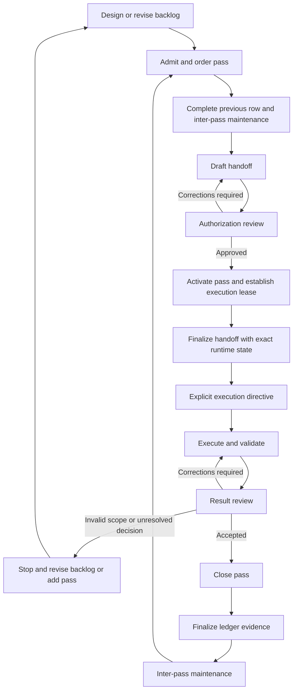

# Backlog-Driven Agent Workflow

This document defines a reusable workflow for planning, executing, reviewing, and closing ordered work through a project backlog.

It is intended for projects where work is:

* dependency-sensitive;
* distributed across human and agent roles;
* executed over multiple sessions;
* tied to exact repository state;
* independently reviewed before later work begins;
* expected to remain understandable after interruptions or loss of conversational context.

This workflow coordinates work but does not independently authorize repository changes.

Detailed evidence-ledger state transitions and SHA semantics are defined in [evidence-ledger-documentation.md](evidence-ledger-documentation.md). Mandatory evidence, review, authorization, and stop rules are defined in [repository-review-protocol.md](repository-review-protocol.md).

## 1. Applicability

Use a backlog-driven workflow when one or more of the following applies:

* tasks must execute in a strict order;
* later work depends on independently accepted earlier work;
* multiple agents or humans perform planning, implementation, and review;
* work spans repositories or ownership boundaries;
* rollback and auditability require exact commit evidence;
* stale plans or documentation could cause incorrect implementation;
* interruptions or handoffs between sessions are expected;
* repository control-plane state determines whether work may begin;
* public contracts, schemas, workflows, migrations, or security boundaries are involved.

A simpler issue-and-pull-request workflow is usually sufficient when tasks are independent, low-risk, small, and do not need durable cross-session coordination.

Do not introduce backlog ceremony merely to subdivide routine implementation.

## 2. Goals

The workflow is designed to provide:

1. stable and reviewable work decomposition;
2. explicit authority and repository boundaries;
3. deterministic mapping from backlog intent to execution handoff;
4. immutable execution leases;
5. separation between planning, execution, review, and acceptance;
6. bounded correction loops;
7. durable evidence of completed work;
8. safe interruption and recovery;
9. measurable process feedback;
10. controlled activation of dependent work.

## 3. Non-goals

This workflow does not:

* replace repository instructions;
* replace technical design documents or architecture decisions;
* grant write authority;
* require a separate agent for every role;
* prescribe a particular AI product or model;
* make passing tests equivalent to acceptance;
* allow the backlog to replace executable evidence;
* require every project decision to live in one file;
* make all work strictly sequential when independent work can safely proceed in parallel.

## 4. Authority and document responsibilities

Each control-plane document should have one primary responsibility.

| Artifact                       | Primary responsibility                                                                                  |
| ------------------------------ | ------------------------------------------------------------------------------------------------------- |
| Current user authorization     | Grants task-specific read and write authority                                                           |
| Repository instructions        | Define repository-wide execution, scope, validation, and protected-file rules                           |
| Project backlog                | Records ordered passes, current project state, project-specific decisions, dependencies, and exceptions |
| Backlog workflow documentation | Defines the reusable end-to-end orchestration lifecycle                                                 |
| Evidence-ledger documentation  | Defines pass states, ledger columns, SHA roles, transitions, and invariants                             |
| Review protocol                | Defines mandatory evidence, review, integrity, start, stop, and authorization gates                     |
| Design documents and ADRs      | Record technical decisions and rationale                                                                |
| Execution handoff              | Converts one activated backlog pass into an exact runtime task contract                                 |
| Execution report               | Records what the executor did and verified                                                              |
| Review report                  | Records independent assessment of the result                                                            |
| Evidence ledger                | Records accepted lifecycle state and immutable result evidence                                          |

The project backlog may link to these artifacts but should not silently redefine them.

If applicable documents disagree, stop before beginning or continuing pass-specific work. Resolve the conflict through an explicitly authorized governance update.

## 5. Core principles

### 5.1 Outcome-oriented passes

A pass describes an independently reviewable outcome, not merely an activity.

Prefer:

> Establish a validated reusable-workflow trust boundary.

Avoid:

> Work on the reusable workflow.

### 5.2 Stable identity

Each pass has one stable identifier and title.

Identifiers must not be reused or renumbered merely because the roadmap changes. New work receives a new identifier or an explicitly approved inserted identifier.

The pass identifier is the primary correlation key across:

* the backlog;
* the evidence ledger;
* branch names;
* handoffs;
* execution reports;
* review reports;
* pull requests;
* follow-up work.

### 5.3 Explicit authority

No backlog item, design document, review report, or ledger state independently authorizes writes.

The current task authorization must identify the permitted repository and scope.

### 5.4 One active ordered pass

For a strictly ordered roadmap, at most one pass may be active.

An active pass remains active throughout:

* planning;
* implementation;
* validation;
* review;
* corrections;
* repeated review.

Zero active passes is valid during inter-pass maintenance.

Projects may define parallel lanes only when their authority boundaries, dependencies, ledgers, and merge order are explicitly independent.

### 5.5 Immutable execution context

Every activated pass is tied to an exact repository snapshot through its task handoff.

Agents must not infer the baseline from:

* the current branch name;
* the latest commit at execution time;
* a merge-base alone;
* chat history;
* an automation branch;
* an unverified pull request.

### 5.6 No silent scope expansion

A handoff may narrow a backlog pass when needed for safety or reviewability.

It must not broaden repositories, files, behavior, authority, or acceptance criteria without explicit maintainer approval.

### 5.7 Independent acceptance

Implementation completion, passing tests, or agent self-review does not close a pass.

Acceptance is a separate decision made by the maintainer or designated reviewer under the project review protocol.

### 5.8 Result and control-plane separation

Pass-result changes and coordination changes have different meanings and should normally use different commits.

A commit that changes status, evidence, or activation state must not be mistaken for the pass result.

### 5.9 Current and planned behavior remain distinct

Backlogs, handoffs, implementation, and documentation must distinguish:

* current implemented behavior;
* accepted future behavior;
* historical behavior;
* unresolved proposals.

Approved future design must not be presented as current behavior.

### 5.10 Durable artifacts over conversational memory

Repository state and approved task artifacts must be sufficient to resume work after an interruption.

Chat history may provide context, but it is not the authoritative execution record.

## 6. Roles

Roles describe responsibilities, not products. A project may assign these roles to humans, agents, or a combination.

### Maintainer

The maintainer:

* owns project intent;
* approves the roadmap;
* resolves authority and design decisions;
* authorizes protected control-plane changes;
* accepts or rejects review gates;
* closes passes;
* activates later passes.

### Backlog designer

The backlog designer:

* decomposes goals into passes;
* establishes ordering and dependencies;
* defines outcomes, scope, validation, and stop conditions;
* identifies planning requirements;
* detects passes that are too broad or not independently reviewable.

### Handoff author

The handoff author:

* translates one activated pass into an executable task contract;
* resolves runtime repository and branch state;
* inserts the exact execution lease;
* preserves backlog intent;
* adds necessary execution and reporting precision.

### Executor

The executor:

* performs the finalized handoff;
* respects its scope and stop conditions;
* validates the result;
* reports deviations and limitations;
* does not mark the pass accepted or completed.

### Reviewer

The reviewer:

* evaluates the result against the backlog pass, approved handoff, repository state, and review protocol;
* verifies evidence rather than relying on executor claims;
* returns an explicit review outcome;
* does not silently implement corrections while acting in a review-only role.

### Control-plane coordinator

The coordinator:

* performs explicitly authorized backlog and ledger updates;
* validates evidence-ledger invariants;
* keeps result commits separate from lifecycle commits;
* does not alter pass-result content during coordination-only changes.

### Role separation

One person or agent may fill multiple roles, but each transition must remain explicit.

For material implementation work, the executor should not be the sole authority accepting its own result.

Tools such as ChatGPT Work, Codex, local development agents, or human reviewers are execution surfaces. They are not workflow roles by themselves.

## 7. Workflow artifacts

### 7.1 Project backlog

The backlog records:

* program outcomes and boundaries;
* ordered passes;
* dependencies;
* project-specific decisions and exceptions;
* pass completion checkboxes;
* current evidence-ledger state;
* links to authoritative supporting documents.

The backlog should not become the only location for detailed technical architecture. Large or reusable design decisions should live in linked specifications or ADRs.

### 7.2 Pass specification

A pass specification defines the stable intent and acceptance contract.

It should avoid runtime values that are not known until activation, such as the future execution-lease SHA.

### 7.3 Execution handoff

The handoff is the runtime contract for one activated pass.

It adds exact repository state, branch state, tool constraints, and execution instructions to the stable pass specification.

### 7.4 Execution report

The execution report records:

* resolved state;
* completed work;
* changed files or review coverage;
* validation performed;
* deviations;
* unverified paths;
* remaining risks;
* Git and repository actions.

### 7.5 Review report

The review report records:

* review scope;
* evidence examined;
* confirmed findings;
* risks and uncertainty;
* required corrections;
* acceptance recommendation.

### 7.6 Evidence ledger

The evidence ledger records accepted lifecycle state. Its detailed semantics are defined in [evidence-ledger-documentation.md](evidence-ledger-documentation.md).

## 8. Recommended backlog structure

A reusable backlog should normally contain the following logical sections.

### 8.1 Purpose and authority

State:

* the program goal;
* the repositories or systems involved;
* the backlog’s authority;
* what the backlog does not authorize;
* links to the workflow, ledger, review, and repository instructions.

### 8.2 Outcomes and completion definition

Define the observable conditions that end the program.

These should describe the final system state rather than merely state that all passes were executed.

### 8.3 Boundaries and non-goals

Record:

* repositories in scope;
* repositories explicitly excluded;
* authority boundaries;
* migration boundaries;
* behavior intentionally deferred.

### 8.4 Decisions and supporting specifications

Link to:

* architecture decisions;
* contract specifications;
* migration plans;
* security or trust models;
* terminology.

Do not duplicate long technical specifications into every pass.

### 8.5 Dependency and milestone model

Describe:

* ordered phases or lanes;
* cross-repository gates;
* release or migration milestones;
* conditions that block an entire phase.

### 8.6 Ordered pass index

Provide a concise index containing:

* identifier;
* title;
* mode;
* dependency;
* current status.

### 8.7 Pass specifications

Define each pass using the formal contract in this document.

Specifications may be inline or stored in linked files. Pass identity and order must remain centralized.

### 8.8 Evidence ledger

Include or link the authoritative ledger.

### 8.9 Project-specific exceptions

Record historical or project-specific deviations from the reusable workflow without weakening the reusable documentation.

## 9. Formal pass contract

Each pass should define the following fields.

### 9.1 Required fields

| Field               | Requirement                                                                        |
| ------------------- | ---------------------------------------------------------------------------------- |
| Identifier          | Stable, unique, ordered pass identifier                                            |
| Title               | Concise outcome-oriented title                                                     |
| Objective           | Observable result the pass must produce                                            |
| Mode                | Planning, implementation, review-only, validation-only, migration, or coordination |
| Rationale           | Why the pass exists and why it occurs at this point                                |
| Dependencies        | Passes, decisions, repository state, or external evidence required first           |
| Scope               | Repositories, surfaces, or artifact classes that may be examined or changed        |
| Required outputs    | Files, decisions, reports, evidence, or executable results                         |
| Acceptance criteria | Conditions that must all be true for acceptance                                    |
| Validation          | Required commands, checks, witnesses, or review evidence                           |
| Review gate         | Who reviews and what must be approved                                              |
| Stop conditions     | Conditions that require the executor to halt                                       |
| Follow-up effect    | What later work becomes eligible after acceptance                                  |

### 9.2 Conditional fields

Add these when relevant:

| Field                          | Use when                                                              |
| ------------------------------ | --------------------------------------------------------------------- |
| Allowed files                  | The writable scope must be exact                                      |
| Prohibited files               | Nearby files would be tempting but unsafe to change                   |
| Required invariants            | Existing behavior or contracts must remain unchanged                  |
| Non-goals                      | Likely scope interpretations must be excluded                         |
| Authority model                | Multiple repositories or owners are involved                          |
| Public contract                | APIs, schemas, workflows, manifests, or formats change                |
| Trust and security constraints | Untrusted input, permissions, secrets, or execution boundaries matter |
| Migration and compatibility    | Existing callers or data require transition treatment                 |
| Rollback                       | Partial deployment or irreversible state is possible                  |
| Required fixtures              | Validation depends on external or synthetic environments              |
| Documentation impact           | User-visible behavior or contracts are affected                       |
| Independent-merge rule         | The pass may or may not safely merge alone                            |

### 9.3 Pass template

```markdown
## <ID> — <Outcome-oriented title>

- [ ] **Completed**

**Mode:** <planning | implementation | review-only | validation-only | migration | coordination>

**Objective:**  
<Observable result>

**Rationale:**  
<Why this pass exists and why it belongs here>

**Dependencies:**

- <required prior pass, decision, or state>

**Scope:**

- repositories: <scope>
- allowed surfaces: <scope>
- prohibited surfaces: <scope>

**Required outputs:**

- <artifact, decision, report, or result>

**Required invariants:**

- <behavior or contract that must remain true>

**Non-goals:**

- <explicitly excluded work>

**Acceptance criteria:**

- <observable condition>

**Validation:**

- `<command or check>` — <required evidence>

**Stop conditions:**

- <condition requiring immediate halt>

**Review gate:**  
<review authority and acceptance requirement>

**Follow-up effect:**  
<later pass or milestone that may become eligible>
```

Sections that do not apply may be omitted, but objective, mode, scope, acceptance criteria, validation, review gate, and stop conditions must remain explicit.

## 10. Pass admission review

Before a proposed pass enters the ordered roadmap, review it for the following.

### 10.1 Outcome clarity

* Is the result observable?
* Can a reviewer decide whether it succeeded?
* Is the pass named after the outcome rather than the activity?

### 10.2 Scope quality

* Is the smallest safe scope identified?
* Are repository and authority boundaries clear?
* Are likely scope-expansion temptations excluded?

### 10.3 Decision readiness

* Are product and architecture decisions already approved?
* Does unresolved design require a planning pass?
* Is the executor being asked to invent policy?

### 10.4 Reviewability

* Can the result be reviewed independently?
* Is the validation evidence available?
* Is there a bounded rollback or correction path?

### 10.5 Ordering

* Are all prerequisites explicit?
* Does the pass unlock something meaningful?
* Is the order driven by dependency rather than convenience?

### 10.6 Atomicity

* Does the pass mix unrelated authority domains?
* Does it combine planning with substantial implementation?
* Does it combine repository migration with source-engine modification?
* Does it combine control-plane updates with pass-result changes?

A pass that fails admission review should be revised, split, merged with another pass, or converted into a planning pass before activation.

## 11. Pass sizing and decomposition

Split a pass when:

* unresolved decisions must precede implementation;
* different repositories have different authority owners;
* parts require different review expertise;
* one part can merge independently and reduce later risk;
* validation requires separate environments;
* rollback boundaries differ;
* a behavior-preserving migration should precede semantic changes;
* the writable allowlist cannot be defined safely;
* the result would be too large for reliable independent review.

Combine passes when:

* the separation creates no independently useful result;
* one pass would leave the repository knowingly inconsistent;
* validation can only prove the combined behavior;
* the split exists only to minimize file count;
* the intermediate state cannot safely merge.

Prefer the smallest pass that produces a coherent, reviewable, and independently meaningful state.

## 12. Choosing the task mode

### Planning pass

Use a planning pass when the work requires approval of:

* public contracts;
* architecture;
* trust boundaries;
* cross-repository ownership;
* filename or path migrations;
* schema evolution;
* compatibility policy;
* rollback strategy;
* exact implementation allowlists.

A planning pass produces decisions and an implementation contract. It does not silently proceed into implementation.

### Implementation pass

Use an implementation pass when:

* required decisions are already approved;
* writable scope is bounded;
* acceptance criteria are executable or directly reviewable;
* expected behavior is sufficiently specified.

### Review-only pass

Use a review-only pass when the output is evidence, classification, findings, or an acceptance recommendation and repository changes are prohibited.

A separate planning phase is not required when the review method, scope, and output are already defined.

### Validation-only pass

Use a validation-only pass when the implementation is fixed and the goal is to establish fresh executable evidence.

### Migration pass

Use a migration pass when compatibility, sequencing, and rollback are first-class requirements.

### Coordination pass

Use a coordination pass only for explicitly authorized control-plane changes. It must not alter pass-result content.

## 13. Workflow lifecycle



The lifecycle distinguishes:

* authorization review of the handoff;
* execution of the handoff;
* review of the execution result;
* maintainer acceptance;
* control-plane closure;
* later-pass activation.

These are separate actions even when one tool or person performs several of them.

## 14. Pass preparation

Before activating a pass:

1. confirm the preceding pass is accepted and fully finalized;
2. complete approved inter-pass maintenance;
3. verify that no pass is currently active;
4. review the selected pass specification;
5. resolve missing decisions;
6. decide whether a separate planning pass is required;
7. identify the expected executor and reviewer roles;
8. draft the execution handoff except for runtime values not yet available;
9. review the draft for faithfulness to the backlog;
10. correct any control-plane inconsistency before activation.

The selected pass remains `Locked` during preparation.

## 15. Handoff creation

The handoff converts a stable pass specification into an exact executable contract.

### 15.1 Backlog correlation

The handoff must identify:

* exact pass identifier;
* exact pass title;
* backlog path;
* backlog revision or reviewed commit;
* section or anchor containing the pass;
* applicable supporting decisions.

The identifier and title must match the backlog.

### 15.2 Runtime lease

The finalized handoff must identify:

* repository;
* target or default branch;
* exact pre-pass baseline SHA;
* pass branch;
* expected branch HEAD;
* approved post-baseline commits, if any;
* expected working-tree state.

Placeholders are not valid in an execution-ready handoff.

### 15.3 Scope and authority

The handoff must state:

* writable repositories;
* writable files or surfaces;
* read-only repositories or control-plane files;
* prohibited actions;
* whether commits, pushes, pull requests, workflow dispatches, or merges are authorized.

### 15.4 Task contract

The handoff must include:

* objective;
* mode;
* approved premises;
* required work;
* required outputs;
* invariants;
* non-goals;
* validation;
* review and reporting requirements;
* stop conditions.

### 15.5 Relationship to the backlog

A handoff may:

* add runtime precision;
* add stricter safety checks;
* narrow writable scope;
* define report formatting;
* resolve tool-specific execution details.

A handoff must not silently:

* change the pass objective;
* broaden scope;
* weaken validation;
* override approved architecture;
* unlock later work;
* modify ledger semantics.

Material divergence requires a backlog or governance update before execution.

## 16. Handoff authorization review

Before execution, review the handoff for:

1. exact backlog identity;
2. objective fidelity;
3. correct task mode;
4. complete runtime lease;
5. valid repository and branch topology;
6. bounded scope;
7. correct authority;
8. adequate validation;
9. complete stop conditions;
10. clear output and reporting requirements;
11. consistency with repository instructions;
12. consistency with the evidence ledger and review protocol.

The review outcome must be one of:

* **Approved for execution**
* **Corrections required**
* **Blocked**
* **Rejected as inconsistent with the backlog**

Approval of the handoff is not approval of the future result.

### Execution-state marker

An approved handoff should be clearly marked:

```text
Handoff state: Approved for execution
```

After approval, do not ask another agent to review, green-light, restate, or forward it unless an independent second authorization review is explicitly required.

## 17. Explicit execution directive

The executor must receive an explicit execution instruction in addition to the finalized handoff.

Recommended form:

```text
Execute the finalized <PASS-ID> handoff now.

Do not review, revise, green-light, restate, or forward the handoff.
It has already received authorization review.

Perform the task and return the required execution report.
Stop only when an explicit start or stop condition is triggered.
```

This distinguishes “review-only task mode” from “review the handoff.”

The executor must not delegate the task to an imaginary later agent when it is the designated executor.

## 18. Activation and execution lease

Activation, baseline recording, and branch creation must follow [evidence-ledger-documentation.md](evidence-ledger-documentation.md).

At a high level:

1. transition the selected pass from `Locked` to `Pending`;
2. commit that activation on the target branch;
3. resolve the activation commit;
4. place that exact SHA in the finalized handoff;
5. create the pass branch from that commit;
6. verify ancestry and branch state;
7. begin pass-specific work only after the lease checks pass.

The active pass remains `Pending` until maintainer acceptance.

## 19. Execution

At the start of execution, the executor must:

1. resolve repository state;
2. verify the execution lease;
3. inspect applicable instructions;
4. verify the backlog progression gate;
5. confirm writable scope;
6. confirm required tools and fixtures;
7. stop on any blocking inconsistency.

During execution, the executor must:

* make only authorized changes;
* preserve required invariants;
* perform the smallest relevant validation;
* report unavailable validation precisely;
* stop instead of silently expanding scope;
* keep documentation and tests aligned when behavior changes;
* distinguish confirmed facts from assumptions;
* preserve unrelated work;
* avoid control-plane changes unless separately authorized.

## 20. Execution report

The execution report should be self-contained and include:

* pass identifier and objective;
* outcome;
* resolved repository and lease state;
* summary and rationale;
* complete changed-file or reviewed-file list;
* validation commands and results;
* tests and documentation assessment;
* deviations from the handoff;
* assumptions;
* self-review;
* remaining risks and unverified paths;
* stop-condition status;
* Git and repository actions;
* suggested commit message when applicable.

A review-only pass should report coverage, evidence, findings, uncertainty, and the exact proposed scope of any follow-up pass.

## 21. Result review

Result review is distinct from handoff authorization review.

The reviewer must compare:

* the stable backlog pass;
* the approved handoff;
* exact repository state;
* the complete result;
* validation evidence;
* repository instructions;
* review-protocol requirements.

The reviewer should not rely solely on the executor’s summary.

### Review outcomes

Use one of:

* **Accepted**
* **Corrections required**
* **Blocked**
* **Invalid execution**
* **Requires backlog or design revision**

### Corrections required

When corrections remain within the approved pass:

* keep the same pass `Pending`;
* normally use the same branch;
* preserve the same execution baseline;
* provide exact findings and required corrections;
* rerun relevant validation;
* repeat result review.

Correction work does not create a new pass merely because another implementation iteration is needed.

### New or revised pass required

Stop and revise the roadmap when:

* scope must expand materially;
* a new authority domain is involved;
* an unresolved architecture decision appears;
* a shared dependency is defective;
* the current allowlist is insufficient;
* correction would violate a required invariant;
* a separate rollback boundary is needed;
* the new work is independently meaningful and reviewable.

## 22. Acceptance and closure

Only the maintainer or designated acceptance authority may accept the review gate.

After acceptance:

1. close the pass according to [evidence-ledger-documentation.md](evidence-ledger-documentation.md);
2. record the accepted result and review evidence;
3. keep later passes locked;
4. merge through the approved process;
5. finalize delayed ledger fields;
6. perform inter-pass maintenance.

Completing one pass does not automatically activate another pass.

Activation of the next pass is a separate lifecycle transition.

## 23. Inter-pass maintenance

Inter-pass maintenance may include:

* ledger finalization;
* governance corrections;
* documentation synchronization;
* branch cleanup;
* dependency updates;
* environment preparation;
* review of the next pass;
* decomposition or insertion of future passes.

During inter-pass maintenance:

* zero passes may be `Pending`;
* later passes remain `Locked`;
* project state may change;
* no next-pass execution lease exists yet;
* maintenance that must survive rollback must complete before activation.

When maintenance is complete, select and activate the next eligible pass through the normal activation procedure.

## 24. Completed work and follow-up defects

Do not rewrite accepted history merely because later evidence reveals a defect.

Prefer a new bounded follow-up pass that records:

* the affected completed pass;
* the newly discovered evidence;
* why the earlier acceptance is insufficient;
* the required correction;
* dependency and migration impact.

A project may define an explicit reopening mechanism, but it must preserve the original evidence and must not casually transition `Completed` back to `Pending`.

## 25. Multi-repository work

For multi-repository programs:

1. classify each repository’s role and authority;
2. identify which repository owns the implementation;
3. separate source implementation from caller migration where practical;
4. avoid changing independent authority domains in one pass;
5. establish exact repository SHAs in the handoff;
6. define cross-repository validation explicitly;
7. do not claim certification without exercising the relevant external boundary;
8. reopen the owning source pass when a shared implementation defect is found;
9. do not patch shared behavior locally in a caller merely to unblock migration.

Each repository may require its own branch and result evidence, but the backlog must make their dependency explicit.

## 26. Interruption and recovery

After an interruption, do not resume from conversational memory alone.

Reconstruct state from:

1. current authorization;
2. repository instructions;
3. backlog status;
4. evidence ledger;
5. activated pass handoff;
6. target and branch SHAs;
7. open pull requests;
8. execution and review reports;
9. exact repository content.

Before resuming:

* confirm which pass is active;
* confirm that no other pass is pending;
* revalidate the execution lease;
* inspect all post-baseline commits;
* confirm working-tree cleanliness;
* confirm whether the last activity was execution, review, correction, closure, or maintenance.

When state cannot be reconstructed unambiguously, stop and require a governance correction.

## 27. Common anti-patterns

### Activity-based passes

A pass says “refactor,” “clean up,” or “work on” without an observable result.

### Unbounded scope

The pass names a broad repository area but does not define allowed or prohibited surfaces.

### Planning hidden inside implementation

The executor is expected to choose architecture, policy, or migration behavior while editing.

### Handoff-review loop

An approved handoff is repeatedly reviewed or forwarded instead of executed.

### Product names used as roles

Instructions say “send to Work” or “give to Codex” without defining whether the tool is planning, executing, or reviewing.

### Premature baseline recording

The active pass’s baseline is written into the ledger before the activation commit exists, creating a trailing reference.

### Result-SHA misuse

An activation, bookkeeping, closure, merge, or finalization commit is recorded as the result despite not containing the pass result.

### Closure activates later work

The current pass’s closure commit also changes the next pass to `Pending`.

### Executor closes its own pass

The executor changes completion state or accepted evidence without explicit coordination authority.

### Silent scope expansion

Unexpected work is included because it appears related or convenient.

### Mixed repository authority

Shared implementation and caller-specific changes are combined without a deliberate cross-repository contract.

### Chat-only decisions

A material decision exists only in conversation and cannot be reconstructed from repository artifacts.

### Duplicated normative rules

The backlog, handoff, review protocol, and ledger documentation independently define conflicting versions of the same state or authority rule.

## 28. Process measurement and optimization

The workflow should be improved using evidence rather than intuition.

Useful measures include:

* number of handoff authorization-review iterations;
* passes stopped by invalid backlog or lease state;
* correction rounds per pass;
* findings caused by ambiguous scope;
* findings caused by missing planning;
* scope-expansion requests;
* unavailable validation tools;
* unexpected branch movement;
* control-plane correction commits;
* handoff-review loops;
* follow-up passes caused by incomplete acceptance criteria;
* elapsed time between activation and accepted result;
* elapsed time spent in inter-pass maintenance.

Metrics should optimize process reliability, not rank individual agents.

### Likely automation candidates

After the manual workflow is stable, consider automating:

* ledger structural validation;
* state-transition validation;
* backlog identifier uniqueness;
* handoff/backlog identity matching;
* branch and baseline lease checks;
* allowed-file diff checks;
* control-plane-only commit checks;
* Markdown link validation;
* evidence-field completeness;
* generation of review checklists.

Automation must enforce the approved workflow rather than silently invent new semantics.

## 29. Adoption checklist

Before adopting this workflow in another project, confirm:

* [ ] a maintainer owns roadmap and acceptance decisions;
* [ ] repository authority boundaries are documented;
* [ ] the backlog has stable pass identifiers;
* [ ] pass specifications use an outcome-oriented contract;
* [ ] the review protocol is adopted;
* [ ] evidence-ledger semantics are adopted;
* [ ] control-plane documents are protected;
* [ ] project-specific exceptions have an owning location;
* [ ] handoff and execution-report expectations are documented;
* [ ] activation and baseline handling are defined;
* [ ] result review is distinct from handoff review;
* [ ] later-pass activation is distinct from current-pass closure;
* [ ] interruption recovery does not depend on chat history;
* [ ] the first pass has passed admission review.

## 30. Reuse guidance

This document intentionally defines a general orchestration workflow.

Project-specific information belongs in the owning project artifacts, including:

* pass identifiers;
* repository names;
* branch naming;
* accepted SHAs;
* technical architecture;
* historical exceptions;
* exact commands;
* tool selection;
* project-specific review criteria;
* project-specific completion conditions.

Projects may simplify this workflow when their risk and dependency structure do not justify every artifact. Simplification must preserve the authority, review, evidence, and state-transition guarantees on which the project relies.
