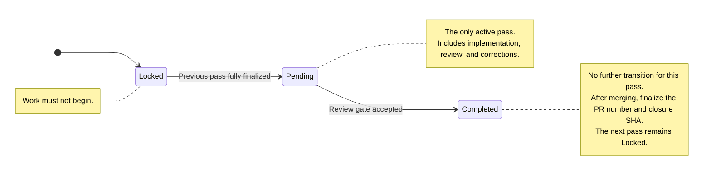

# [Evidence Ledger](repository-maintenance-orchestrator-recovery-backlog.md/#9-evidence-ledger) Documentation

The evidence ledger serves to document the current state of indiividual backlog items including mapping of those state to an actual Git commit.

Updateing the ledger must follow a well-defined workflow/algorithm to ensure integrity and avoid blocking conditions caused by outdated data. 

## Terminology

- **Pass** - Refers to a backlog item

## Table description

| Column                    | Meaning                                                               | Value established                                           | Ledger populated                      |
| ------------------------- | --------------------------------------------------------------------- | ----------------------------------------------------------- | ------------------------------------- |
| `Status`                  | Pass progression state                                                | At each state transition                                    | In the transition commit              |
| `Pre-pass baseline SHA`   | Exact activation snapshot and execution lease                         | When the pass is activated and before its branch is created | When the pass is closed               |
| `Result SHA`              | Accepted pass-result commit                                           | When the final result commit is selected                    | When the pass is closed               |
| `PR #`                    | PR delivering the accepted pass                                       | When the PR is created                                      | In the post-merge finalization commit |
| `Review-gate closure SHA` | Commit marking the pass `Completed` and recording acceptance evidence | When the closure commit is created                          | In the post-merge finalization commit |
| `Tests/runs`              | Accepted validation and review evidence                               | At review acceptance                                        | In the closure commit                 |
| `Reviewer`                | Maintainer accepting the pass                                         | At review acceptance                                        | In the closure commit                 |

## States

The ledger reflects the different states of each backlog item following strict transition rules, resembling a state machine. Violating this rules can result in a block until the conflicting states have been resolved.

> [!NOTE]
> There can only be a single pas active at the time.

### Status glossary

| Status | Meaning |
|---|---|
| `Locked` | The preceding pass has not been formally closed; work must not begin. |
| `Pending` | The preceding pass is closed and this is the only pass that is currently running or eligible to start. |
| `Completed` | The maintainer has accepted the pass result and closed pass-specific work. The next pass remains Locked. Post-merge fields such as PR number and review-gate closure SHA may still require ledger finalization. |

### Initial state

#### State name

`Locked`

#### State transitions 

From: -
To: `Pending`

Current pass: `Locked`  
Previous pass: `Locked` (inactive) or `Pending` (active or incomplete) or `Completed`  
Next pass: `Locked`

### Activated state

#### State name

`Pending`

#### State transitions 

From: `Locked`  
To: `Completed`

Current pass: `Pending`  
Previous pass: `Completed`  
Next pass: `Locked`

> [!NOTE]
> The pass remains `Pending` throughout implementation, review, and corrections.

Transition is only allowed after the previous row is fully finalized (see [Accepted and closed state](#accepted-and-closeed-state)) and all maintenance is complete:

1. Change current pass' `Status` column from `Locked` to `Pending`.
2. Commit that change on `main`.
3. Record that commit SHA in the handoff as the pre-pass baseline.
    > [!IMPORTANT]
    > The pre-pass baseline is supplied literally in the current task handoff but not entered into the ledger table at this point (to avoid commit drift/trailing). It must be an ancestor of every pass-specific commit and should normally be the direct parent of the first pass-specific commit. Preparation commits that must survive a rollback belong before the pre-pass baseline. Equality with `git merge-base` is neither required nor sufficient.
4. Create the pass branch from exactly that commit.
    > [!IMPORTANT]
    > Before branching, the previuos pass' row must be completely populated and the next pass must have `Status´` set to `Pending`.  
    > A new pass always starts after the branching from `main`. The `Pre-pass baseline SGA` column is still empty as it will be populated after result of the pass becomes available. This means, all columns except `Pass` and `Status` remain empty for the started pass (backlog item).
5. Leave the ledger’s baseline cell empty until closure.
6. Execute pass

### Accepted and closeed state

#### State name

`Completed`

#### State transitions 

From: `Pending`  
To: -

Current pass: `Completed`  
Previous pass: `Completed`  
Next pass: `Locked`

Transition is only allowed after the review gate passes.

**Before merging**

1. Fill the historical pre-pass baseline.
2. Fill the accepted result SHA or review-only N/A.
3. Fill tests/runs and reviewer.
4. Change status to `Completed`.
5. Check the completion checkbox.
6. Leave the next pass Locked.
7. Commit this as the review-gate closure commit.
8. Merge

**After merging**

Finalize row:

1. Fill the PR number.
2. Fill the review-gate closure SHA.
3. Perform any remaining maintenance.
4. Keep the next pass Locked.
5. Commit final state as pre-pass baseline ready state.
6. Declare the next pass the new current pass and tarnsition that pass into the activated state (see [Activated state](#activated-state)) to start it.

This produces an unambiguous history and makes each blocking condition inspectable.

