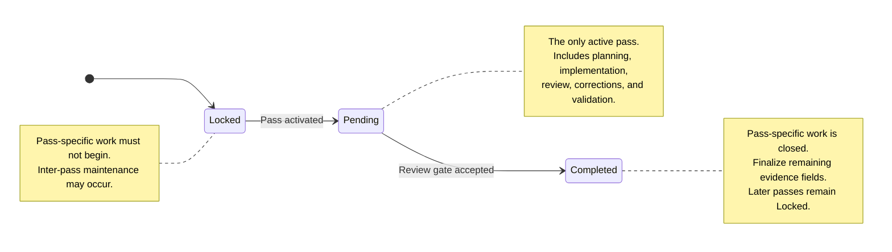

# Evidence Ledger Documentation

The evidence ledger records the lifecycle and accepted evidence of ordered backlog passes. It maps each pass state to immutable Git history and provides blocking conditions that prevent work from starting against incomplete, stale, or contradictory coordination data.

Updating the ledger must follow the workflow defined here. Ad hoc updates can create ambiguous baselines, incomplete closure records, or invalid pass transitions.

## Authority and precedence

The evidence-ledger workflow uses the following authority model:

1. The current user prompt supplies write authority.
2. The project backlog records current pass state, accepted evidence, and project-specific exceptions.
3. The repository review protocol defines mandatory start, stop, review, and authorization gates.
4. This document defines reusable ledger-column semantics, state transitions, and population timing.
5. Repository instructions define protected control-plane and execution rules.

If these sources conflict, stop before beginning or continuing pass-specific work. Resolve the conflict through a maintainer-controlled governance update.

The evidence ledger and its supporting documentation do not independently authorize repository changes.

## Terminology

* **Pass** — One ordered backlog item.
* **Current pass** — The pass whose status is `Pending`.
* **Previous pass** — The immediately preceding pass in roadmap order.
* **Later pass** — Any pass after the current or selected pass.
* **Pass-specific work** — Planning, implementation, review, correction, or validation performed to satisfy one pass.
* **Inter-pass maintenance** — Coordination, governance, cleanup, or other approved work performed after one pass is complete and before another pass is activated.
* **Fully finalized row** — A completed-pass ledger row in which every required evidence field has been populated.
* **Activation commit** — The commit on the target branch that changes one eligible pass from `Locked` to `Pending`.
* **Execution lease** — The exact activation-commit SHA supplied literally in the pass handoff as the pre-pass baseline.
* **Result commit** — The accepted commit containing the pass-specific result.
* **Review-gate closure commit** — The maintainer-controlled commit that marks the pass `Completed`, records accepted review evidence, and checks the pass completion box.
* **Post-merge finalization commit** — A later commit that records values that could not be recorded in the review-gate closure commit, such as its own SHA and the delivering pull-request number.

## Ledger columns

| Column                    | Meaning                                                                       | Value established                                        | Ledger populated                                   |
| ------------------------- | ----------------------------------------------------------------------------- | -------------------------------------------------------- | -------------------------------------------------- |
| `Pass`                    | Stable ordered backlog identifier                                             | When the roadmap is defined                              | Predefined; never reused, duplicated, or reordered |
| `Status`                  | Pass progression state                                                        | At each state transition                                 | In the transition commit                           |
| `Pre-pass baseline SHA`   | Exact activation snapshot and execution lease                                 | When the pass is activated, before its branch is created | When the pass is closed                            |
| `Result SHA`              | Accepted commit containing the pass-specific result                           | When the final reviewed result commit is selected        | When the pass is closed                            |
| `PR #`                    | Pull request that delivered the accepted pass result and closure state        | When the pull request is merged                          | In the post-merge finalization commit              |
| `Review-gate closure SHA` | Commit that marked the pass `Completed` and recorded accepted review evidence | When the review-gate closure commit is created           | In the post-merge finalization commit              |
| `Tests/runs`              | Concise accepted validation and review evidence                               | At review acceptance                                     | In the review-gate closure commit                  |
| `Reviewer`                | Maintainer or reviewer who accepted the review gate                           | At review acceptance                                     | In the review-gate closure commit                  |

> [!IMPORTANT]
> When the owning backlog includes the reusable [ordered pass index](backlog-workflow-documentation.md#86-ordered-pass-index), every ledger `Status` transition must update the matching index row's `Status` in the same coordination commit.
>
> The index is navigational, not a second state authority. Its pass identity, order, and displayed status must mirror the authoritative ledger. Treat any disagreement as a blocking control-plane contradiction.

### Special values

For a pure review pass that produces no repository result commit, use:

```text
N/A — review-only; no repository change
```

in `Result SHA`.

When no pull request delivered the result, use:

```text
N/A
```

in `PR #`.

Do not use a bookkeeping, activation, closure, merge, or finalization commit as the `Result SHA` unless that commit actually contains the accepted pass-specific result.

## Self-reference and delayed population

A commit cannot contain its own final SHA.

The `Review-gate closure SHA` must therefore be populated in a later commit. Similarly, the delivering pull-request number is finalized after merge.

A pass may consequently have:

* `Status` set to `Completed`;
* its completion checkbox checked;
* accepted `Result SHA`, `Tests/runs`, and `Reviewer` recorded;
* but temporarily empty `PR #` and `Review-gate closure SHA` cells.

This is a valid intermediate closure state.

The row is not **fully finalized** until all required fields have been populated. No later pass may be activated before that finalization is complete.

## States

The ledger follows strict state-transition rules.

At most one pass may have `Pending` status. Zero pending passes is valid during inter-pass maintenance and ledger finalization.

Violating the state, ordering, or evidence rules creates a blocking condition that must be resolved before pass-specific work can proceed.

### Status glossary

| Status      | Meaning                                                                                                                                                                                                                                                                            |
| ----------- | ---------------------------------------------------------------------------------------------------------------------------------------------------------------------------------------------------------------------------------------------------------------------------------- |
| `Locked`    | The pass has not been activated. Pass-specific work must not begin. A pass remains locked while its predecessor is incomplete, while the predecessor’s row is awaiting finalization, while inter-pass maintenance is in progress, or until the maintainer explicitly activates it. |
| `Pending`   | The pass is the only active pass. Its activation commit has been created, its execution lease has been established, and it is eligible for or currently undergoing planning, implementation, review, correction, or validation.                                                    |
| `Completed` | The maintainer has accepted the pass result and closed pass-specific work. The next pass remains `Locked`. Post-merge evidence fields may still require finalization.                                                                                                              |



## Locked state

### Entry

A pass begins in `Locked`.

A later pass also remains `Locked` while:

* the previous pass is incomplete;
* the previous pass’s ledger row is not fully finalized;
* governance or maintenance work is underway;
* the maintainer has not explicitly selected it for activation.

### Exit transition

```text
Locked → Pending
```

The transition is performed only through the activation workflow.

## Activated state

### State name

```text
Pending
```

### Entry transition

```text
Locked → Pending
```

### Exit transition

```text
Pending → Completed
```

### Required preconditions

Before activation:

1. The immediately preceding pass has its completion checkbox checked.
2. The preceding pass has status `Completed`.
3. The preceding pass row is fully finalized.
4. All approved inter-pass maintenance is complete.
5. The selected pass appears exactly once and has status `Locked`.
6. The selected pass completion checkbox is unchecked.
7. Every later pass remains `Locked`.
8. No row is missing, duplicated, reordered, or contradictory.
9. The target branch is in the expected reviewed state.
10. The maintainer has explicitly authorized the activation update.

If any condition fails, do not activate the pass.

### Activation procedure

1. Select the next eligible locked pass.
2. Change only that pass’s `Status` from `Locked` to `Pending`.
3. Commit the activation change on the target branch.
4. Resolve the exact activation-commit SHA.
5. Supply that SHA literally in the pass handoff as the `Pre-pass baseline SHA`.
6. Create the pass branch from exactly that activation commit.
7. Leave the pass’s `Pre-pass baseline SHA` ledger cell empty.
8. Verify the branch and lease before pass-specific work begins.
9. Execute the pass.

The activation commit should be a dedicated coordination commit. Any additional content in it must be explicitly approved, reviewed, and intended to form part of the pass baseline.

> [!IMPORTANT]
> The pass is activated when the `Locked` → `Pending` transition is committed on the target branch.
>
> Pass-specific work starts only after the pass branch has been created from that activation commit and the execution-lease checks have passed.

> [!IMPORTANT]
> The pre-pass baseline is not entered into the active pass’s ledger row at activation time. Recording it before committing the activation transition would create a trailing SHA reference.
>
> The accepted baseline is recorded later, when the pass is closed.

### Execution-lease checks

Before planning or editing, and again in the final pass report:

1. Resolve the task-supplied baseline commit.
2. Confirm that the pass branch was created from that commit.
3. Confirm that the baseline is an ancestor of every pass-specific commit.
4. Inspect every commit after the baseline.
5. Confirm that no unexpected or unapproved change exists.
6. Confirm that the target-branch and pass-branch leases have not moved unexpectedly.
7. Confirm that the working tree contains no unrelated change.

The pre-pass baseline is the rollback and comparison point. It is not defined merely by `git merge-base`, although the activation workflow should normally make it both the branch point and direct parent of the first pass-specific commit.

Preparation or maintenance changes that must survive a rollback belong before the activation commit.

### Pending-state invariant

The pass remains `Pending` throughout:

* planning;
* implementation;
* validation;
* review;
* corrections;
* repeated review;
* preparation of the accepted result.

Passing tests or producing an agent self-review does not transition the pass to `Completed`.

Only maintainer acceptance of the review gate authorizes completion.

## Accepted and closed state

### State name

```text
Completed
```

### Entry transition

```text
Pending → Completed
```

### Exit transition

None.

A completed pass never returns to `Pending`. Defects found after completion require an explicitly authorized follow-up pass or reopening procedure defined by the owning project.

### Completion preconditions

The transition is allowed only when:

1. The pass-specific result is complete.
2. The complete diff or review output has been independently reviewed.
3. The review gate has been accepted by the maintainer.
4. Required validation and review evidence is available.
5. The accepted result commit has been identified, or the pass is confirmed as review-only.
6. The historical pre-pass baseline has been verified.
7. No stop condition remains unresolved.
8. The maintainer has explicitly authorized the control-plane closure update.

### Before merging

Perform a maintainer-controlled, coordination-only closure update:

1. Populate the historical `Pre-pass baseline SHA`.
2. Populate the accepted `Result SHA`, or the review-only `N/A` value.
3. Populate `Tests/runs`.
4. Populate `Reviewer`.
5. Change `Status` from `Pending` to `Completed`.
6. Check the pass completion checkbox.
7. Leave every later pass `Locked`.
8. Commit this as the review-gate closure commit.
9. Validate the closure diff.
10. Merge through the approved repository process.

The review-gate closure commit:

* must be explicitly authorized;
* must modify only approved control-plane fields;
* must not alter pass-result files;
* is not the pass `Result SHA`;
* does not activate the next pass.

### Closure validation

Before merging the closure update:

* confirm the accepted `Result SHA` is unchanged;
* confirm the recorded baseline matches the executed handoff;
* confirm validation evidence and reviewer are present;
* confirm the pass appears exactly once;
* confirm its checkbox and status agree;
* confirm every later pass remains `Locked`;
* confirm no unrelated control-plane field changed;
* run `git diff --check`;
* perform the repository’s required Markdown and link checks.

### After merging

Finalize the completed pass row:

1. Populate the delivering `PR #`, or explicit `N/A`.
2. Populate the `Review-gate closure SHA`.
3. Commit the finalized completed row.
4. Perform any remaining approved inter-pass maintenance.
5. Keep every later pass `Locked`.

The completed pass lifecycle ends here.

To begin another pass, select the next eligible locked pass and follow the [Activated state](#activated-state) procedure. Activation is a separate state transition for the selected pass and is not part of completing the previous pass.

## Fully finalized row

A completed pass row is fully finalized only when it contains:

* `Status: Completed`;
* historical `Pre-pass baseline SHA`;
* accepted `Result SHA`, or the required review-only value;
* `PR #`, or explicit `N/A`;
* `Review-gate closure SHA`;
* accepted `Tests/runs`;
* `Reviewer`;
* a checked pass completion checkbox.

A later pass must remain `Locked` until the preceding row is fully finalized and all inter-pass maintenance is complete.

## Start gate for a pending pass

Before pass-specific work begins, verify:

1. The immediately preceding pass is fully finalized.
2. The selected pass appears exactly once.
3. The selected pass has status `Pending`.
4. Its completion checkbox is unchecked.
5. Its evidence cells other than `Pass` and `Status` are still empty.
6. Every later pass remains `Locked`.
7. The task handoff supplies the exact activation-commit SHA.
8. The pass branch was created from exactly that activation commit.
9. No unexpected post-baseline commit or working-tree change exists.
10. All applicable instructions and control-plane documents agree.

If any condition fails, stop and report the exact integrity defect.

## Blocking conditions

Pass-specific work must not begin or continue when any of the following is true:

* more than one pass is `Pending`;
* a pass is `Pending` while its predecessor row is incomplete;
* a later pass is not `Locked`;
* the pass order is missing, duplicated, or altered;
* a completion checkbox disagrees with its ledger status;
* a completed row lacks required accepted evidence when a later pass is activated;
* the task-supplied baseline cannot be resolved;
* the pass branch does not descend from the supplied baseline;
* unexpected changes exist after the baseline;
* the target branch or pass branch moved during a leased review;
* the ledger, backlog, review protocol, or repository instructions contradict one another;
* a protected control-plane update lacks explicit authorization.

Resolve the contradiction through a maintainer-controlled governance or coordination update before resuming.

## Core invariants

The ledger workflow preserves these invariants:

1. At most one pass is `Pending`.
2. Zero pending passes is valid.
3. A pass cannot skip `Locked`.
4. A pass cannot transition directly from `Locked` to `Completed`.
5. A completed pass cannot become pending again.
6. Later passes remain locked throughout the current pass lifecycle.
7. The execution lease is established before branch creation.
8. The baseline ledger cell is populated only after the pass result is known.
9. The review-gate closure commit does not activate the next pass.
10. Post-merge finalization and next-pass activation are separate operations.
11. The next pass is activated only after the preceding row is fully finalized and maintenance is complete.
12. Pass-result commits and control-plane commits remain distinguishable.
13. Every recorded SHA has one explicit semantic role.
14. No ledger update depends on a commit containing its own SHA.
15. Project-specific historical exceptions are documented in the owning backlog, not in this reusable workflow document.

## Recommended commit separation

The workflow should normally produce distinct commits for distinct responsibilities:

1. **Pass-result commit**

   * contains the accepted pass-specific result;
   * becomes `Result SHA`.

2. **Review-gate closure commit**

   * records accepted baseline, result, evidence, reviewer, status, and checkbox;
   * becomes `Review-gate closure SHA`;
   * leaves later passes locked.

3. **Post-merge finalization commit**

   * records PR number and closure SHA;
   * may be followed by additional maintenance;
   * leaves later passes locked.

4. **Next-pass activation commit**

   * changes only the next eligible pass from `Locked` to `Pending`;
   * becomes that pass’s pre-pass baseline and execution lease.

Combining these responsibilities should be treated as an exception requiring explicit justification and review.

## Reuse guidance

This document intentionally defines a general ledger workflow.

Project-specific information belongs in the owning backlog, including:

* historical exceptions;
* pass identifiers;
* repository names;
* accepted SHAs;
* pull-request numbers;
* project-specific maintenance requirements;
* deviations made before this workflow was adopted.

A project that adopts this workflow should ensure that its backlog, review protocol, repository instructions, and ledger table use the same column names and state definitions.
